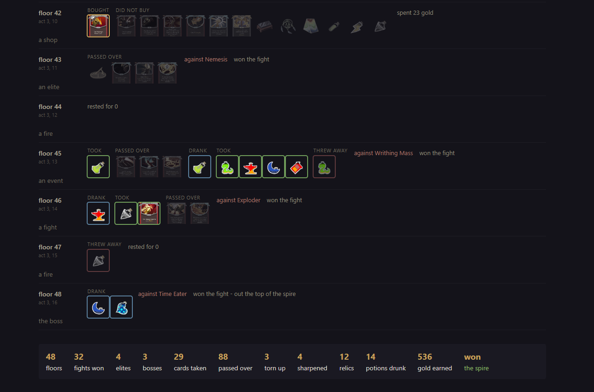
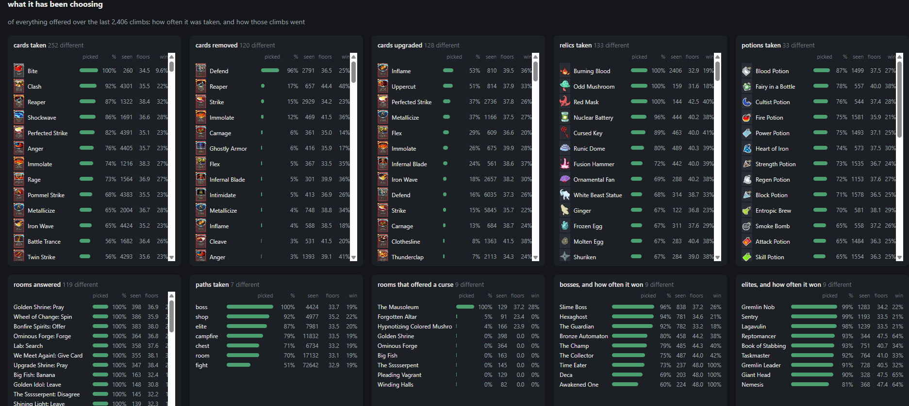

# conquer-the-spire


[](https://github.com/utilForever/conquer-the-spire/blob/master/LICENSE) [](https://travis-ci.org/utilForever/conquer-the-spire/branches) [](https://ci.appveyor.com/project/utilForever/conquer-the-spire/branch/master) [](https://utilforever.visualstudio.com/conquer-the-spire/_build/latest?definitionId=9&branchName=master)

[](https://codecov.io/gh/utilForever/conquer-the-spire)
[](https://www.codacy.com/manual/utilForever/conquer-the-spire?utm_source=github.com&amp;utm_medium=referral&amp;utm_content=utilForever/conquer-the-spire&amp;utm_campaign=Badge_Grade)
[](https://lgtm.com/projects/g/utilForever/conquer-the-spire/alerts/)
[](https://lgtm.com/projects/g/utilForever/conquer-the-spire/context:cpp)
[](https://www.codefactor.io/repository/github/utilforever/conquer-the-spire)

[](https://sonarcloud.io/dashboard?id=conquer-the-spire) [](https://sonarcloud.io/dashboard?id=conquer-the-spire) [](https://sonarcloud.io/dashboard?id=conquer-the-spire) [](https://sonarcloud.io/dashboard?id=conquer-the-spire) [](https://sonarcloud.io/dashboard?id=conquer-the-spire)

conquer-the-spire is Slay the Spire simulator using C++ with some reinforcement learning. The code is built on C++17 and can be compiled with commonly available compilers such as g++, clang++, or Microsoft Visual Studio. conquer-the-spire currently supports macOS (10.14 or later), Ubuntu (18.04 or later), Windows (Visual Studio 2017 or later), and Windows Subsystem for Linux (WSL). Other untested platforms that support C++17 also should be able to build conquer-the-spire.

## Key Features

  * C++17 based Slay the Spire library
  * Console and GUI simulator program
  * C++ and Python API

## Implementation List

  * Cards
    * Ironclad Cards
    * Silent Cards
    * Defect Cards
    * Colorless Cards
    * Status
    * Curse
  * Characters
    * Ironclad
    * Silent
    * Defect
  * Enemies
    * Monsters
    * Elites
    * Bosses
  * Others
    * Events
    * Relics
    * Potions
    * Merchant
    * Ascension
  * Reinforcement learning
    * Connecting with PyTorch C++ API
    * Applying DQN and so on
  * API Support
    * Python

## Quick Start

You will need CMake to build the code. If you're using Windows, you need Visual Studio 2017 in addition to CMake.

First, clone the code:

```
git clone https://github.com/utilForever/conquer-the-spire.git --recursive
cd conquer-the-spire
```

### C++ API

For macOS or Linux or Windows Subsystem for Linux (WSL):

```
mkdir build
cd build
cmake ..
make
```

For Windows:

```
mkdir build
cd build
cmake .. -G"Visual Studio 15 2017 Win64"
MSBuild conquer-the-spire.sln /p:Configuration=Release
```

### Docker

```
docker pull utilforever/conquer-the-spire:latest
```

## Documentation

TBA

## The climber

An Ironclad trained with PPO on this engine, twelve million climbs in, and
a search that plays each turn out before it is played. On two hundred
climbs a reading, each played to its end, on two sets of seeds - one of
which nothing had ever been measured on:

| how it plays | won | floors |
|---|---|---|
| the policy names its own move | 25.5% | 35.9 |
| two moves walked one step each | 39.0% | 38.5 |
| the turn played out inside fights | **74.5%** | 45.1 |

Act limit 3, so the spire's own top - act 4 and the Heart - is not in any
of it, and every number is against this engine's rules rather than the
game's.

The search walks its sequences on a copy of the fight, and the copy
carries the run's own random state - so what it sees is exactly what will
happen, the next hand of cards included. That is the same information a
player has who saves and reloads to find out, and more of it at once: a
reload tries one line, the search weighs a hundred and twenty. Worth
knowing before setting this beside anything that plays blind.

The gap between the first row and the last is the interesting part. Five
training runs all peaked at the same place, 22.5% won, and then lost the
third act's boss fight and nothing else - the floors, the act bosses and
the share of climbs reaching two bosses never moved. Raising the entropy
floor, turning the curriculum off, raising lambda, and putting that one
fight from 4.7% of a batch to 18.3% each changed how fast the fall came
and none of them lifted the peak.

What lifted it was not training. A turn is a sequence: block only counts
once the monsters have swung, and they swing inside the move that ends
the turn, so the first card of a turn says almost nothing about what the
turn comes to. Searching the turn - sequences grown a move at a time,
four carried, each scored by what it paid plus what the value head says
about where it left the climb - doubled the wins on weights that had
stopped improving a month earlier. The ceiling was on what the policy
could *name*, not on what it could play like. Notes/ has the measurements.

### The weights

The climber these numbers are from is [best-look2.pt][weights], 119 MB,
on the releases page rather than in the repository - GitHub refuses a file
that size in one, and a clone should not carry it either way. Put it here
and everything below finds it:

```
runs/ironclad/best-look2.pt
```

    update    356200
    climbs    12,365,345
    sha256    32cf432bd30298f9588e8d0176d512a5b415f79fb781f769289279f41344440b

It is a PyTorch checkpoint and carries everything needed to play it: the
width of the net, the act limit, what a point of health cost in training.
Nothing else from the run is needed.

Training your own instead takes about a day to reach the plateau on one
GPU. `train.bat` asks what to train and remembers the answers.

[weights]: https://github.com/yuchinchenTW/conquer-the-spire/releases/download/v1-ironclad/best-look2.pt

### Running it

Four things, each on a double-click, on Windows:

| | |
|---|---|
| `train.bat` | trains, and stops itself if the wins fall away |
| `judge.bat` | scores checkpoints on fixed seeds beside the training |
| `play.bat` | plays, and writes a climb out as a page |
| `watch.bat` | draws the curves as they are written |

`play.bat` option 7 writes one climb as a page: every card it took beside
every card it passed over, floor by floor, in the game's own art. Run
`python Scripts/get_card_art.py` once for the pictures. The last seven
floors of a climb that won, as it comes out:



Green is what it took, faded is what it passed over, red is what it threw
away or tore up, blue is a potion drunk. Two things worth noticing in
this one: it spent 23 gold in the shop on floor 42 and walked past
everything else there, and it rested twice at full health, on floors 44
and 47, where a whetstone would have been worth more. The fires are the
policy's own decision - the search only runs inside fights.

The dashboard the trainer keeps as it goes, at nine million climbs:



## How To Contribute

Contributions are always welcome, either reporting issues/bugs or forking the repository and then issuing pull requests when you have completed some additional coding that you feel will be beneficial to the main project. If you are interested in contributing in a more dedicated capacity, then please contact me.

## Contact

You can contact me via e-mail (utilForever at gmail.com). I am always happy to answer questions or help with any issues you might have, and please be sure to share any additional work or your creations with me, I love seeing what other people are making.

## License


The class is licensed under the [MIT License](http://opensource.org/licenses/MIT):

Copyright &copy; 2019 [Chris Ohk](http://www.github.com/utilForever) and [Gyojun Youn](https://github.com/youngyojun).

Permission is hereby granted, free of charge, to any person obtaining a copy of this software and associated documentation files (the "Software"), to deal in the Software without restriction, including without limitation the rights to use, copy, modify, merge, publish, distribute, sublicense, and/or sell copies of the Software, and to permit persons to whom the Software is furnished to do so, subject to the following conditions:

The above copyright notice and this permission notice shall be included in all copies or substantial portions of the Software.

THE SOFTWARE IS PROVIDED "AS IS", WITHOUT WARRANTY OF ANY KIND, EXPRESS OR IMPLIED, INCLUDING BUT NOT LIMITED TO THE WARRANTIES OF MERCHANTABILITY, FITNESS FOR A PARTICULAR PURPOSE AND NONINFRINGEMENT. IN NO EVENT SHALL THE AUTHORS OR COPYRIGHT HOLDERS BE LIABLE FOR ANY CLAIM, DAMAGES OR OTHER LIABILITY, WHETHER IN AN ACTION OF CONTRACT, TORT OR OTHERWISE, ARISING FROM, OUT OF OR IN CONNECTION WITH THE SOFTWARE OR THE USE OR OTHER DEALINGS IN THE SOFTWARE.